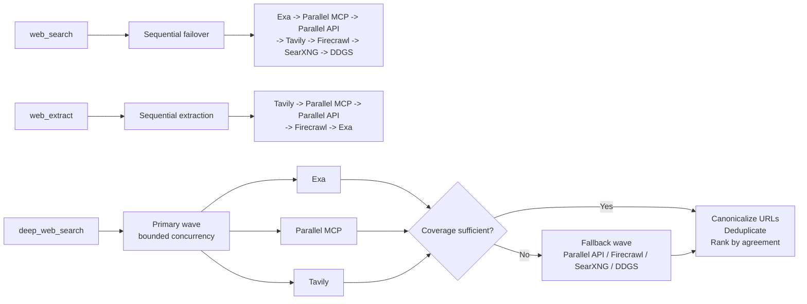

# hermes-resilient-web

[English](README.md) | [简体中文](README.zh-CN.md)

A community plugin for [Hermes Agent](https://github.com/NousResearch/hermes-agent) that adds:

- ordered failover for the built-in `web_search` and `web_extract` tools;
- `deep_web_search`, a parallel multi-provider discovery tool;
- URL canonicalization, deduplication, and provider-agreement ranking;
- persistent cooldowns for quota, authentication, rate-limit, forbidden, and transient failures.

This repository is not an official Nous Research project.

## How it works

The plugin reuses Hermes' built-in provider implementations. It does not reimplement vendor SDKs or store credentials.



| Path | Default providers |
|---|---|
| Sequential search | Exa, Parallel MCP, Parallel API, Tavily, Firecrawl, SearXNG, DDGS |
| Sequential extract | Tavily, Parallel MCP, Parallel API, Firecrawl, Exa |
| Deep-search primary wave | Exa, Parallel MCP, Tavily |
| Deep-search fallback wave | Parallel API, Firecrawl, SearXNG, DDGS |

`deep_web_search` assigns up to four complementary queries across the primary providers. It starts the fallback wave when the primary wave returns fewer than eight unique results or fewer than two providers succeed. Fallback calls are queued with a default concurrency limit of three.

Results with the same canonical URL are merged. Sources returned by multiple providers rank ahead of single-provider results, followed by configured provider priority and original result position.

## Requirements

- Hermes Agent `0.21.5` or newer
- Python `3.11` through `3.14`, matching Hermes' supported range
- At least one usable Hermes web provider

Optional provider dependencies can be prepared through Hermes:

```bash
hermes pm install \
  --extra exa \
  --extra parallel-web \
  --extra firecrawl \
  --extra ddgs \
  --extra mcp
```

Install only the extras needed by your configured routes.

## Installation

From a published GitHub repository:

```bash
hermes -p PROFILE plugins install xiaoxipanda/hermes-resilient-web --enable
```

From a local clone:

```bash
hermes -p PROFILE plugins install \
  file:///absolute/path/to/hermes-resilient-web \
  --enable
```

Or run the included helper:

```bash
./scripts/install-local.sh PROFILE
```

Then select the provider in the target profile's `config.yaml`:

```yaml
web:
  search_backend: resilient-web
  extract_backend: resilient-web

plugins:
  enabled:
    - resilient-web
```

Restart or hot-reload the profile's plugins as required by your Hermes deployment. Start a new conversation if an existing session cached its previous tool schema.

## Configuration

Copy the relevant sections from [`config.example.yaml`](config.example.yaml). Plugin settings live under:

```yaml
plugins:
  entries:
    resilient-web:
      settings:
        deep_min_results: 8
        deep_min_successful_providers: 2
        deep_fallback_parallelism: 3
```

An empty provider-order list disables that route. Unknown or unavailable providers are skipped.

### Credentials and endpoints

Set credentials in the target Hermes profile's `.env`, never in `config.yaml`:

```dotenv
EXA_API_KEY=
PARALLEL_API_KEY=
PARALLEL_SEARCH_MODE=fast
TAVILY_API_KEY=
FIRECRAWL_API_KEY=
FIRECRAWL_API_URL=
SEARXNG_URL=http://127.0.0.1:8080
```

See [`.env.example`](.env.example) for the complete template.

- Parallel MCP defaults to the official anonymous endpoint at `https://search.parallel.ai/mcp`.
- `FIRECRAWL_API_KEY` uses Firecrawl Cloud.
- `FIRECRAWL_API_URL` points Hermes at a self-hosted Firecrawl instance.
- Firecrawl's anonymous cloud route is best-effort and may return HTTP 403.
- SearXNG must already be running; this plugin does not deploy it.
- DDGS is search-only and requires Hermes' `ddgs` extra.

## Tool selection

Use ordinary `web_search` for a simple lookup or when one source is sufficient. It tries providers in order and stops at the first usable response.

Use `deep_web_search` for research that benefits from source diversity:

```json
{
  "query": "Assess the current support status of Python free-threading",
  "queries": [
    "Python free-threading official documentation",
    "PEP 703 implementation status",
    "Python 3.14 free-threaded build limitations"
  ],
  "results_per_provider": 5,
  "max_results": 20,
  "parallelism": 3
}
```

Use `web_extract` afterward on selected first-party or authoritative results. Search snippets are discovery evidence, not a substitute for reading the source.

## Privacy and cost

Deep search sends query text to multiple configured services. Do not include secrets, private customer data, or sensitive internal context in search queries.

Each provider keeps its own quota, billing, retention, and privacy policy. The plugin does not enable paid plans or automatic top-ups. It records only provider names, failure categories, timestamps, and cooldown deadlines in:

```text
$HERMES_HOME/cache/resilient-web-state.json
```

Raw API keys are neither written to this file nor returned in provider reports. Error strings are redacted before logging.

## Failure behavior

- Empty sequential results continue to the next provider by default.
- HTTP 402/quota errors cool down until the next UTC month.
- HTTP 429, authentication, HTTP 403, and transient failures use configurable cooldowns.
- One failed deep-search worker does not cancel other providers.
- Cooldown persistence is advisory. If the cache cannot be written, requests still continue.

## Development

Run the standard-library test suite:

```bash
python -m unittest discover -s tests -v
python -m compileall -q .
```

Validate the plugin against an installed Hermes checkout:

```bash
hermes plugins validate . --json
```

The `Hermes compatibility` workflow resolves the latest published Hermes release
and also checks Hermes `main`. Each lane prepares that revision's locked runtime
and runs its real `hermes plugins validate` command against this repository.

Hermes integration details are isolated in [`compat.py`](compat.py). Provider
availability uses the public `is_available()` and `is_keyless_available()`
contracts; a missing built-in provider module is skipped without preventing the
plugin from loading.

Tests use fake providers and make no network calls. See [`CONTRIBUTING.md`](CONTRIBUTING.md) before submitting changes.

## License

MIT. See [`LICENSE`](LICENSE).
