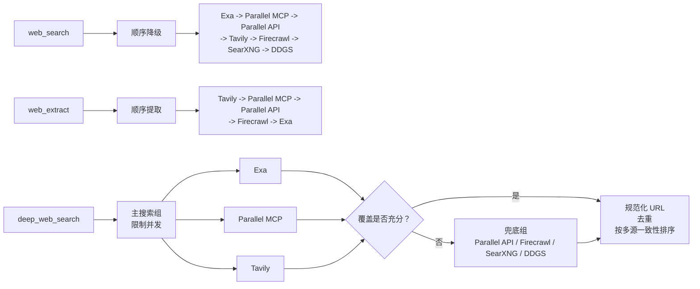

# hermes-resilient-web

[English](README.md) | [简体中文](README.zh-CN.md)

这是一个面向 [Hermes Agent](https://github.com/NousResearch/hermes-agent) 的社区插件，提供：

- 为原生 `web_search` 和 `web_extract` 增加顺序故障转移；
- 新增并行多来源发现工具 `deep_web_search`；
- URL 规范化、结果去重和多 Provider 一致性排序；
- 针对额度、认证、限流、禁止访问和临时故障的持久冷却。

本仓库不是 Nous Research 官方项目。

## 工作方式

插件复用 Hermes 内置的 Provider 实现，不重复实现各厂商 SDK，也不存储凭据。



| 路径 | 默认 Provider |
|---|---|
| 顺序搜索 | Exa、Parallel MCP、Parallel API、Tavily、Firecrawl、SearXNG、DDGS |
| 顺序提取 | Tavily、Parallel MCP、Parallel API、Firecrawl、Exa |
| 深度搜索主组 | Exa、Parallel MCP、Tavily |
| 深度搜索兜底组 | Parallel API、Firecrawl、SearXNG、DDGS |

`deep_web_search` 会把最多四个互补查询分配给主组 Provider。当主组得到的唯一结果少于 8 条，或成功 Provider 少于 2 个时，插件会启动兜底组。兜底调用默认最多 3 路并发。

相同规范化 URL 的结果会被合并。多个 Provider 同时命中的来源优先，其次按照配置的 Provider 优先级和原始结果位置排序。

## 环境要求

- Hermes Agent `0.21.5` 或更高版本
- Python `3.11` 至 `3.14`，与 Hermes 支持范围一致
- 至少一个可用的 Hermes Web Provider

可以通过 Hermes 准备可选 Provider 依赖：

```bash
hermes pm install \
  --extra exa \
  --extra parallel-web \
  --extra firecrawl \
  --extra ddgs \
  --extra mcp
```

只需安装实际启用的 Provider 对应依赖。

## 安装

从 GitHub 安装：

```bash
hermes -p PROFILE plugins install xiaoxipanda/hermes-resilient-web --enable
```

从本地仓库安装：

```bash
hermes -p PROFILE plugins install \
  file:///absolute/path/to/hermes-resilient-web \
  --enable
```

也可以使用仓库内的辅助脚本：

```bash
./scripts/install-local.sh PROFILE
```

然后在目标 Profile 的 `config.yaml` 中选择 Provider：

```yaml
web:
  search_backend: resilient-web
  extract_backend: resilient-web

plugins:
  enabled:
    - resilient-web
```

根据部署方式重启 Gateway 或热加载插件。已有会话可能缓存旧工具 schema，需要新建会话后才能看到 `deep_web_search`。

## 配置

从 [`config.example.yaml`](config.example.yaml) 复制需要的配置。插件设置位于：

```yaml
plugins:
  entries:
    resilient-web:
      settings:
        deep_min_results: 8
        deep_min_successful_providers: 2
        deep_fallback_parallelism: 3
```

Provider 顺序配置为空列表时会禁用对应路径。未知或不可用的 Provider 会被跳过。

### 凭据与服务地址

凭据必须写入目标 Hermes Profile 的 `.env`，不能写入 `config.yaml`：

```dotenv
EXA_API_KEY=
PARALLEL_API_KEY=
PARALLEL_SEARCH_MODE=fast
TAVILY_API_KEY=
FIRECRAWL_API_KEY=
FIRECRAWL_API_URL=
SEARXNG_URL=http://127.0.0.1:8080
```

完整模板见 [`.env.example`](.env.example)。

- Parallel MCP 默认使用官方匿名端点 `https://search.parallel.ai/mcp`。
- `FIRECRAWL_API_KEY` 对应 Firecrawl 云服务。
- `FIRECRAWL_API_URL` 用于自托管 Firecrawl。
- Firecrawl 匿名云端接口属于尽力而为，可能返回 HTTP 403。
- SearXNG 必须提前部署，本插件不会自动创建实例。
- DDGS 只支持搜索，并依赖 Hermes 的 `ddgs` extra。

## 工具选择

简单查询、已知页面定位或只需一个来源时，使用普通 `web_search`。它按照配置顺序尝试，拿到第一份可用结果后停止。

需要来源多样性的正式调研使用 `deep_web_search`：

```json
{
  "query": "核实 Python free-threading 的当前支持状态",
  "queries": [
    "Python free-threading 官方文档",
    "PEP 703 实施状态",
    "Python 3.14 free-threaded build 限制"
  ],
  "results_per_provider": 5,
  "max_results": 20,
  "parallelism": 3
}
```

完成来源发现后，再对选中的官方或一手来源执行 `web_extract`。搜索摘要只用于发现来源，不能替代正文核验。

## 隐私与费用

深度搜索会把查询文本发送给多个已配置服务。不要在查询中包含密钥、客户隐私或敏感内部信息。

每个 Provider 都有自己的额度、计费、数据保留和隐私政策。本插件不会开通付费套餐或自动充值，只会把 Provider 名称、失败分类、时间和冷却截止时间记录到：

```text
$HERMES_HOME/cache/resilient-web-state.json
```

API Key 不会写入该文件，也不会出现在 Provider 报告中。错误信息在写日志前会进行脱敏。

## 故障处理

- 顺序搜索得到空结果时，默认继续尝试下一个 Provider。
- HTTP 402 或额度耗尽会冷却到下一个 UTC 月。
- HTTP 429、认证失败、HTTP 403 和临时故障使用可配置冷却时间。
- 单个深度搜索任务失败不会取消其他 Provider。
- 冷却状态属于辅助信息；缓存无法写入时，搜索仍会继续。

## 开发

运行不联网的标准库测试：

```bash
python -m unittest discover -s tests -v
python -m compileall -q .
```

使用已安装的 Hermes 验证插件：

```bash
hermes plugins validate . --json
```

`Hermes compatibility` 工作流会动态获取 Hermes 最新稳定版本，同时检查 Hermes
`main`。每个任务都会使用对应版本的锁定运行时，并对本仓库执行真实的
`hermes plugins validate`。

Hermes 集成细节集中在 [`compat.py`](compat.py)。Provider 可用性只通过公开的
`is_available()` 和 `is_keyless_available()` 接口判断；某个内置 Provider
模块缺失时会跳过该 Provider，不会导致整个插件加载失败。

提交修改前请阅读 [`CONTRIBUTING.md`](CONTRIBUTING.md)。

## 许可证

MIT，详见 [`LICENSE`](LICENSE)。
